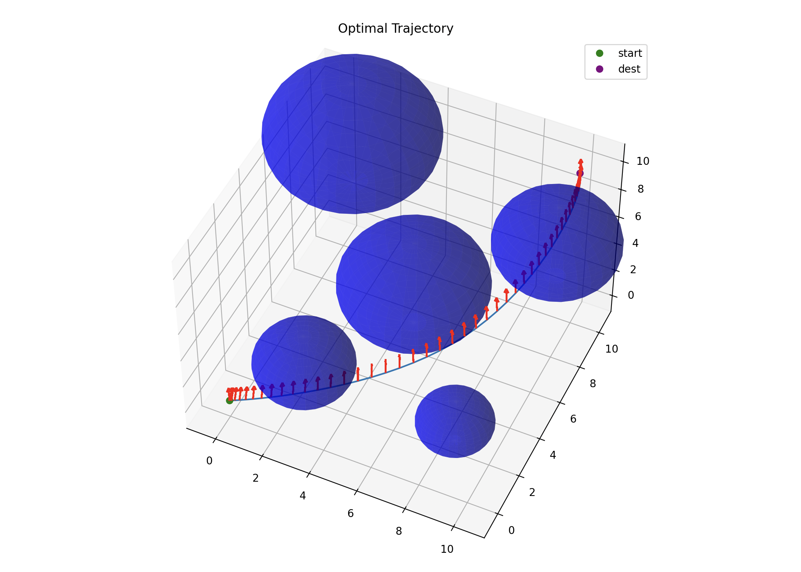

# trajopt

A lightweight autonomous drone flight trajectory optimizer in C++.

Dependencies:
- [Epigraph](https://github.com/EmbersArc/Epigraph)
- [Eigen](https://eigen.tuxfamily.org/index.php?title=Main_Page)
- [Matplotlib](https://matplotlib.org/)

Set up:
```
./setup.sh
```

Build:
```
make
```

Run:
```
./main
```

Visualize:
```
python3 script/viz.py
```

Example:


