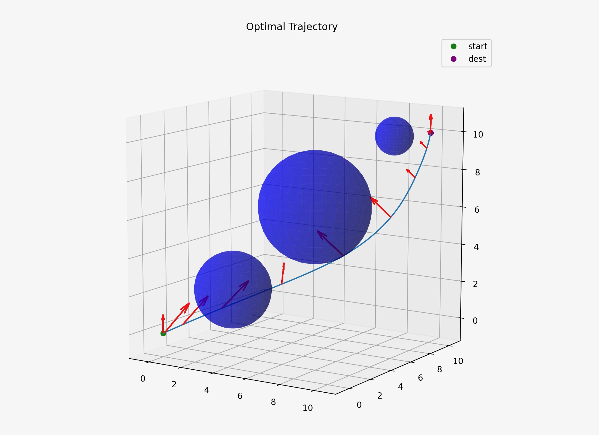

# trajopt

A lightweight Python script for trajectory optimization.

Dependencies:

- [CVXPY](https://www.cvxpy.org/)
- [SciPy](https://scipy.org/)
- [NumPy](https://numpy.org/)
- [Matplotlib](https://matplotlib.org/)

Run:

```
cd src
python3 ctcs.py
```

Example:


